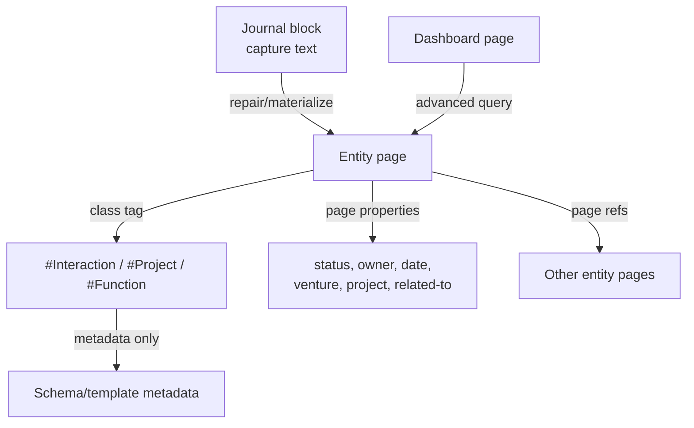
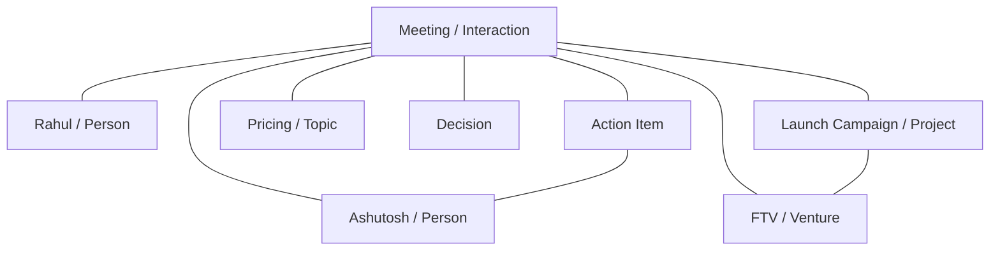

# LSS DB White Paper

## Building a Typed Knowledge Graph in Logseq DB

Version: 2026-06-20  
Repository: `AshutoshMahindru/lss-db`  
Plugin: `logseq-lss-db-final-plugin` v2.0.0

## Executive Summary

LSS DB is a Logseq DB plugin and schema pack for building a typed personal and operational knowledge graph. It treats Logseq pages as durable entities, Logseq DB tags as class/type labels, and page properties as the canonical place for facts, states, dates, ownership, and relationships.

The system is intentionally not a folder hierarchy. It is a typed graph:

- A page's class tag says what the page is.
- A page's properties say what is known about the page.
- Relationship properties connect pages to other pages.
- Journal blocks are capture surfaces, not durable entity records.
- Repair/materialization commands convert tagged journal captures into entity pages.
- Dashboards are query-backed graph views over typed entities.

The current implementation has moved away from native Logseq tag properties as the entity schema source because Logseq renders native tag properties on any tagged block. That behavior pollutes journal pages when a user tags a capture block with `#Function`, `#Project`, `#Interaction`, or another LSS entity class. The coded setup now removes LSS entity schema fields from native tags and materializes those fields onto entity pages instead.

## The Problem Being Solved

Logseq is excellent for capture, linking, and block-level thinking. Logseq DB adds typed properties and tags, but the default behavior can become noisy when tags are used as both class labels and property schema carriers.

LSS needs to support workflows like:

- Capture a meeting in a journal.
- Relate it to a person, project, venture, topic, decision, and action items.
- See the same meeting from the person page, project page, venture page, and review dashboards.
- Keep journal pages readable.
- Keep entity pages structured.
- Avoid duplicating properties in templates, tags, and page bodies.

The main design challenge is separating capture, classification, entity data, and graph relationships.

## Core Design Principle

Use this rule:

```text
#Tag = what kind of thing this is
property:: value = fact or relationship about this thing
[[Page]] = graph node / entity reference
```

For example:

```text
Rahul - Launch Campaign Meeting
#Interaction

lss-object-type:: Interaction
participants:: [[Rahul]], [[Ashutosh]]
related-to:: [[FTV]], [[Launch Campaign]], [[Pricing]]
venture:: [[FTV]]
project:: [[Launch Campaign]]
date:: 20260620
status:: captured
```

The page is an `Interaction`. It is not a `Person`, `Project`, and `Venture` at the same time. Those are related entities, not additional class tags.

## Conceptual Architecture



LSS has four major surfaces:

1. Capture surface: journals and ordinary blocks.
2. Entity surface: durable pages with class tags and page properties.
3. Schema/control surface: generated schema, template, tag, relationship, and command pages.
4. Dashboard surface: query-backed views over typed entities.

## Canonical Area Model

The generated `LSS Area Model` page renders the high-level ontology as a navigable graph map. It keeps canonical registry names stable while exposing user-facing aliases where the operating language differs from the stored schema.

### Areas

```text
Area/Health
Area/Wealth
Area/Learning
Area/Family
Area/Friends
Area/Work
Area/Pursuits
Area/Cross-Cutting
```

### Entities by Area

#### 🏥 Health

```text
Entity-Page/Regime     — Health related action system
Entity-Page/Diet       — Dietary protocol
Entity-Page/Exercise   — Physical workout
Entity-Page/Condition  — Diagnosed health condition
Entity-Page/Therapy    — Ongoing therapy
Entity-Page/Treatment  — Treatment course
Entity-Page/Medicine   — Specific medication
```

#### 🪙 Wealth

```text
Entity-Page/Account
Entity-Page/FinancialAsset — displayed as Asset; canonical name remains FinancialAsset
```

`FinancialAsset` is intentionally not renamed to `Asset` because Logseq has built-in and common usage around asset-like concepts. LSS keeps the canonical tag/page stable and exposes `Asset` as a display alias.

#### 📚 Learning

```text
Entity-Page/Subject   — Knowledge domain
Entity-Page/Course    — Structured learning program
Entity-Page/Lesson    — Discrete learning session
Entity-Page/Concept   — Specific idea within a subject
Entity-Page/Skill     — Capability being built
Entity-Page/Ability   — Capacity or developed ability
```

#### 🏠 Family

Family does not introduce a separate entity class in this pass. It uses cross-cutting `Person`, `Document`, `Interaction`, `Event`, `Commitment`, `Note`, and related forms with contextual tags and matching properties:

```text
#family-relation/parent
#family-relation/child
#family-relation/sibling
#family-relation/partner
#family-relation/extended-family
#family-relation/household

family-relation:: parent / child / sibling / partner / extended-family / household
```

#### 👥 Friends

Friends also uses cross-cutting `Person` and forms. Closeness is modeled both as contextual tags and as a structured page property:

```text
#closeness/inner-circle
#closeness/close
#closeness/regular
#closeness/acquaintance
#closeness/dormant

closeness:: inner-circle / close / regular / acquaintance / dormant
```

#### 💼 Work

```text
Entity-Page/Venture      — Business you own/run
Entity-Page/Function     — Business function
Entity-Page/Project      — Bounded effort
Entity-Page/Work-Stream  — WorkStream, canonical registry name WorkStream
```

Work roles are contextual tags plus structured relationship fields:

```text
#org-role/founder
#org-role/owner
#org-role/employee
#org-role/contractor
#org-role/advisor
#org-role/investor
#org-role/customer
#org-role/vendor
#org-role/regulator
#org-role/partner

role::
relationship-context::
```

#### 🧭 Pursuits

```text
Entity-Page/Pursuit
```

#### 🌐 Cross-Cutting Entities and Artifacts

Core cross-cutting entities:

```text
Entity-Page/Person        — Individual human
Entity-Page/Document      — Contracts, decks, filings, policies
Entity-Page/Notebook      — Curated thematic collection of notes
Entity-Page/Organisation  — Companies, institutions, regulators, etc.
```

Extended cross-cutting artifact types already present in the registry:

```text
Entity-Page/File
Entity-Page/Output
Entity-Page/Report
Entity-Page/Proposal
Entity-Page/Presentation
Entity-Page/SOP
Entity-Page/Essay
Entity-Page/ResearchBrief
```

Confidentiality can be used across Wealth, Work, Health, and personal records:

```text
#confidential/public
#confidential/internal
#confidential/private
#confidential/financial
#confidential/legal
#confidential/medical

confidentiality:: public / internal / private / financial / legal / medical
```

### Forms

Forms are capture and event records. They can be block-first or page-materialized depending on use:

```text
Form/Interaction
Form/Question
Form/Insight
Form/Idea
Form/Decision
Form/Work-Stream        — display alias for canonical WorkStreamUpdate
Form/Action-Item
Form/Note
```

The registry also includes review and date-oriented forms:

```text
Form/Review
Form/Daily-Review
Form/Weekly-Review
Form/Monthly-Review
Form/Important-Date
Form/Commitment
Form/Event
```

### Word Extenders

Word extenders support vocabulary, naming, shorthand, prompt reuse, and query reuse:

```text
Word Extender/Term
Word Extender/Phrase
Word Extender/Prompt Fragment
Word Extender/Abbreviation
Word Extender/Naming Rule
Word Extender/Style Rule
Word Extender/Alias
Word Extender/Domain Vocabulary
Word Extender/Query Snippet
```

The area hierarchy seeds `DomainVocabulary` pages, object types seed `NamingRule` pages, common property names seed `Abbreviation` pages, and dashboard views seed `QuerySnippet` pages.

## Tags, Properties, and Metadata

### Class Tags

Class tags classify a page or block.

Examples:

```text
#Venture
#Function
#Project
#Person
#Organisation
#Interaction
#Decision
#ActionItem
#Question
#Insight
#Idea
#Document
#Review
```

Correct usage:

```text
Launch Campaign
#Project
```

Incorrect usage:

```text
Rahul - Launch Campaign Meeting #Interaction #Person #Project #Venture
```

That says the meeting is a person, project, and venture. It is not. It is an interaction related to those entities.

### Page Properties

Page properties are the canonical place for entity data:

```text
status:: active
owner:: [[Ashutosh]]
venture:: [[FTV]]
project:: [[Launch Campaign]]
participants:: [[Rahul]], [[Ashutosh]]
related-to:: [[FTV]], [[Launch Campaign]], [[Pricing]]
review-date:: 20260620
```

These properties belong on the entity page, not on the native Logseq tag.

### Meta Tag Properties

Native tag metadata should describe the tag/class itself, not the instances.

Safe metadata for `#Interaction`:

```text
lss-kind:: entity-class
schema-page:: [[Entity-Page/Interaction]]
template:: [[Template/Interaction]]
description:: A meeting, call, message, or exchange.
lss-managed-by:: lss-db
schema-version:: 1.0.0
```

Do not bind these as native tag properties:

```text
status
owner
venture
project
participants
review-date
priority
stage
confidence
```

Why: Logseq will display native tag properties on every tagged block, including journal blocks. LSS does not want journal capture blocks to become full entity records.

## Current Coded Policy

The repository now encodes this policy:

```text
1. Native tags are class labels.
2. Native tag properties are not used for LSS entity schema fields.
3. Entity schema fields are materialized onto entity pages.
4. Templates are layout and query scaffolds only.
5. Journal captures are cleaned after materialization.
6. Dashboards query entity pages through advanced query blocks.
```

In code, this is implemented mainly in:

```text
src/modules/setup.ts       native tag/property setup and tag-property cleanup
src/modules/templates.ts   native template installation and layout-only templates
src/modules/repair.ts      journal materialization and page property repair
src/modules/queries.ts     dashboard query generation and repair
src/modules/diagnose.ts    query/path diagnostics
src/registry/data.json     schema registry and command/audit metadata
```

## Command Setup Sequence

The plugin exposes numbered commands. The setup sequence is:

```text
lss: 1setup-all
```

or step by step:

```text
lss: 2setup-bootstrap
lss: 3setup-areas
lss: 4setup-schema-pages
lss: 5setup-db-tags
lss: 6setup-tag-properties
lss: 7setup-relationships
lss: 8setup-templates
lss: 9setup-dashboards
lss: 10setup-word-extenders
lss: 11setup-db-native-config
lss: 12setup-page-tree
lss: 13verify-schema
```

The important DB-native command is:

```text
lss: 11setup-db-native-config
```

It now:

- Ensures native class tags exist.
- Ensures native properties exist where the plugin can own or register them.
- Adds tag inheritance where configured.
- Removes LSS entity schema fields from native tag property lists.

It does not add `status`, `venture`, `owner`, `review-date`, etc. to native entity tags.

## Entity Page Model

Every durable LSS entity page has:

```text
1. One primary class tag.
2. lss-object-type for compatibility and fallback detection.
3. Page properties for facts and relationships.
4. Optional layout sections and query-backed sections.
```

Example:

```text
Marketing
#Function

lss-object-type:: Function
venture:: [[FTV]]
area:: [[Area/Work]]
status:: active
owner::
review-date:: 20260620

Notes
- ...

Projects
- query-backed section
```

## Universal Properties

These properties can apply across many entity types:

| Property | Meaning | Type |
|---|---|---|
| `lss-object-type` | Canonical object type | text/enum |
| `status` | Lifecycle state | enum |
| `area` | Life/work area | page ref |
| `owner` | Accountable person | page ref |
| `created-on` | Creation/capture date | date |
| `review-date` | Next review date | date |
| `source` | Source page/document/system | ref/text |
| `confidence` | Confidence level | enum |
| `visibility` | Access/privacy level | enum |
| `related-to` | General graph edge | page refs |

`related-to` is the escape valve for graph links that do not deserve a more specific relationship.

## Relationship Properties

Use explicit relationship properties when the edge has a strong meaning:

| Property | Typical Target |
|---|---|
| `venture` | `#Venture` |
| `function` | `#Function` |
| `project` | `#Project` |
| `workstream` | `#WorkStream` |
| `participants` | `#Person`, sometimes `#Organisation` |
| `owner` | `#Person` |
| `assigned-to` | `#Person` |
| `stakeholders` | `#Person`, `#Organisation` |
| `topics` | `#Topic`, `#Concept`, or ordinary pages |
| `decisions` | `#Decision` |
| `actions` | `#ActionItem` |
| `outputs` | `#Output`, `#Document`, `#File` |
| `depends-on` | any relevant entity |
| `blocks` | any relevant entity |

Use `venture` or `project` when that relationship is operationally meaningful. Use `related-to` when the relationship is associative.

## Typed Graph, Not Hierarchy

The graph should not be modeled as:

```text
Venture
  Project
    Meeting
      Person
```

It should be modeled as:



The same interaction can appear on:

- Rahul page.
- Ashutosh page.
- Launch Campaign page.
- FTV page.
- Pricing topic page.
- Weekly review.
- Open actions dashboard.

No single parent owns it.

## Worked Example: Meeting With a Person About a Project in a Venture

### Journal Capture

In the journal:

```text
- Met [[Rahul]] about [[Launch Campaign]] for [[FTV]]. Need to send campaign brief.
```

This is a simple capture. It does not need to become a full entity unless it is important.

If it should become a durable interaction:

```text
- Rahul - Launch Campaign Discussion #Interaction
```

### Materialized Entity Page

After repair/materialization:

```text
Rahul - Launch Campaign Discussion
#Interaction

lss-object-type:: Interaction
date:: 20260620
participants:: [[Rahul]], [[Ashutosh]]
related-to:: [[FTV]], [[Launch Campaign]]
venture:: [[FTV]]
project:: [[Launch Campaign]]
topics:: [[Marketing]], [[Pricing]]
status:: captured

Notes
- Met Rahul about the launch campaign.
- Need to send campaign brief.

Actions
- [[Send Rahul campaign brief]]
```

### Journal After Materialization

The journal should be cleaned to:

```text
- [[Rahul - Launch Campaign Discussion]]
```

It should not retain:

```text
participants::
project::
venture::
status::
review-date::
```

### Related Pages

The related pages remain separate typed entities:

```text
Rahul
#Person

lss-object-type:: Person
organisation::
status:: active
```

```text
Launch Campaign
#Project

lss-object-type:: Project
venture:: [[FTV]]
function:: [[Marketing]]
owner:: [[Ashutosh]]
status:: active
priority:: high
deadline::
```

```text
FTV
#Venture

lss-object-type:: Venture
status:: active
owner:: [[Ashutosh]]
stage:: build
```

## Entity Type Recommendations

### Venture

Purpose: a long-running initiative, business, thesis, or strategic effort.

Recommended properties:

```text
lss-object-type:: Venture
status::
area::
owner::
stage::
start-date::
review-date::
related-to::
```

Useful query sections:

- Functions
- Projects
- Workstreams
- Interactions
- Decisions
- Open actions
- Documents/outputs

### Function

Purpose: an operational capability inside or across ventures.

```text
lss-object-type:: Function
venture::
area::
owner::
status::
review-date::
related-to::
```

Example:

```text
Marketing
#Function

venture:: [[FTV]]
status:: active
owner::
```

### Project

Purpose: a time-bound effort with outcomes.

```text
lss-object-type:: Project
venture::
function::
owner::
status::
priority::
start-date::
deadline::
review-date::
related-to::
```

### WorkStream

Purpose: a persistent lane of work, often inside a project or venture.

```text
lss-object-type:: WorkStream
venture::
project::
function::
owner::
status::
related-to::
```

### Person

Purpose: a person node.

```text
lss-object-type:: Person
status::
organisation::
role::
email::
phone::
related-to::
```

Interactions should be queried by:

```text
participants includes current page
```

not manually listed forever on the person page.

### Organisation

```text
lss-object-type:: Organisation
status::
website::
sector::
relationship-status::
people::
related-to::
```

### Interaction

Purpose: meeting, call, email, chat, conversation, or meaningful exchange.

```text
lss-object-type:: Interaction
interaction-type::
date::
participants::
related-to::
venture::
project::
topics::
outputs::
actions::
decisions::
status::
```

### Decision

```text
lss-object-type:: Decision
status::
decided-on::
decided-by::
related-to::
venture::
project::
rationale::
confidence::
```

### ActionItem

```text
lss-object-type:: ActionItem
status::
priority::
owner::
assigned-to::
due-date::
scheduled::
related-to::
venture::
project::
source::
```

### Question

```text
lss-object-type:: Question
status::
asked-on::
asked-by::
related-to::
venture::
project::
answer::
```

### Insight

```text
lss-object-type:: Insight
captured-on::
confidence::
related-to::
source::
```

### Idea

```text
lss-object-type:: Idea
status::
captured-on::
related-to::
confidence::
```

### Document / File / Output

```text
lss-object-type:: Document
status::
owner::
related-to::
venture::
project::
url::
source::
```

```text
lss-object-type:: Output
status::
owner::
related-to::
venture::
project::
delivered-on::
```

### Review

```text
lss-object-type:: Review
review-period::
date::
related-to::
outcomes::
actions::
decisions::
```

## Templates

Templates are layout and query scaffolds only.

They should contain:

- Title/section structure.
- Query sections.
- Empty notes/action/decision areas.

They should not contain schema property lines as ordinary visible content.

The code enforces this by:

- Stripping property lines out of template bodies.
- Sourcing default page properties from `RegistryObject`.
- Disabling `Apply template to tags` for DB entity templates.
- Configuring DB advanced query blocks inside template sections.

## Journal Materialization

`lss:50repair-current-page` is the recovery and materialization command.

When run on a journal page, it:

1. Removes LSS entity schema properties from native tags where possible.
2. Finds journal blocks tagged with LSS entity class tags.
3. Derives or creates an entity page name.
4. Ensures page-level properties on the entity page.
5. Applies the class tag to the entity page.
6. Copies useful block content/children to the entity page.
7. Replaces the original journal block with a clean page link.

Before:

```text
- marketing #Function
  status:: active
  venture::
  review-date:: 20260620
```

After:

```text
- [[marketing]]
```

Entity page:

```text
marketing
#Function

lss-object-type:: Function
venture::
status:: active
review-date:: 20260620
```

## Dashboard Query Architecture

Dashboard pages use advanced query block structure so they behave as Logseq DB query blocks, but the query payload is Logseq query DSL:

```text
{:query (and (tags Function)
             (property :plugin.property.logseq-lss-db-final-plugin/venture <% current page %>))}
```

This was chosen because the latest diagnostics showed:

- Raw Datalog advanced query forms could return zero hits for plugin properties.
- Logseq DSL with plugin property idents returned the expected entity pages.
- Advanced query block structure is still needed for DB query UI behavior.

The current canonical path is:

```text
DB /Advanced Query block
  -> code child
    -> EDN map
      -> :query contains Logseq DSL
```

The diagnostic signal for a healthy Venture Functions section is:

```text
query-match:: yes
query-needs-repair:: no
live-query-stored:: 2
live-query-channel/stored:: advanced-dsl
```

## Setup Commands and Their Responsibilities

| Command | Responsibility |
|---|---|
| `lss:1setup-all` | Run all scaffold/setup steps |
| `lss:2setup-bootstrap` | Create root and control pages |
| `lss:3setup-areas` | Create area pages |
| `lss:4setup-schema-pages` | Create entity/form/word schema-control pages |
| `lss:5setup-db-tags` | Create DB tag contract pages |
| `lss:6setup-tag-properties` | Create tag-property contract pages without binding schema to native tags |
| `lss:7setup-relationships` | Create relationship contract pages |
| `lss:8setup-templates` | Install native templates for entity-page materialization |
| `lss:9setup-dashboards` | Create dashboard contract pages |
| `lss:10setup-word-extenders` | Create word extender entries |
| `lss:11setup-db-native-config` | Create native tags/properties and remove entity schema properties from native tags |
| `lss:12setup-page-tree` | Create page tree |
| `lss:13verify-schema` | Verify expected scaffold pages |
| `lss:50repair-current-page` | Materialize journal entities, repair page properties, repair dashboard queries |
| `lss:51diagnose-current-page` | Write a detailed diagnostic report |
| `lss:52new-function` | Create a Function entity page |

## Operational Guidance

### When Capturing

Prefer lightweight journal capture:

```text
- Met [[Rahul]] about [[Launch Campaign]] for [[FTV]].
```

Only tag the capture as an entity when you want it materialized:

```text
- Rahul - Launch Campaign Discussion #Interaction
```

### When Creating Entities

Create or materialize a page with one primary class tag:

```text
Launch Campaign
#Project
```

Then add properties:

```text
venture:: [[FTV]]
function:: [[Marketing]]
owner:: [[Ashutosh]]
status:: active
```

### When Relating Entities

Use properties, not extra class tags:

```text
participants:: [[Rahul]], [[Ashutosh]]
project:: [[Launch Campaign]]
venture:: [[FTV]]
related-to:: [[Pricing]]
```

### When Cleaning Existing Graphs

Run:

```text
lss: 11setup-db-native-config
```

to remove schema fields from native tags.

Run:

```text
lss: 50repair-current-page
```

on affected journal pages to materialize and clean tagged capture blocks.

Run:

```text
lss: 51diagnose-current-page
```

on important entity/dashboard pages to verify query behavior.

## Invariants

The coded setup should maintain these invariants:

```text
1. Native entity tags do not own LSS instance schema properties.
2. Entity pages own instance properties.
3. Templates are layout/query scaffolds, not property sources.
4. Journal blocks do not retain durable entity schema fields after repair.
5. Dashboards query entity pages through class tags and relationship properties.
6. Relationships are page references, not string labels.
7. Query blocks are repaired to the canonical advanced DSL EDN shape.
```

## Risks and Edge Cases

### Existing Native Tag Properties

Older setup runs may have already added `status`, `venture`, `owner`, and similar fields to native tags. These fields can continue to show on journal blocks until removed.

Mitigation:

```text
lss: 11setup-db-native-config
```

and then:

```text
lss: 50repair-current-page
```

### API Availability

Some cleanup depends on Logseq's `removeTagProperty` API. If unavailable, the plugin records a note and cannot fully remove native tag schema bindings.

### Existing Journal Blocks

If Logseq already injected visible property lines into a journal block, repair must clean the block content and/or materialize it into an entity page.

### Duplicate or Ambiguous Entity Names

Materialization derives an entity page name from the journal block. Ambiguous names may need manual renaming.

### Relationship Values as Text

Relationships should use page references. Text values like `FTV` may not resolve correctly in DB queries. Repair tools attempt to convert obvious text relationships into page references, but intentional review is still important.

## Recommended Future Work

1. Add a dedicated command to clean native tag properties across all LSS tags with a concise report.
2. Add diagnostics for "tag still has native schema properties".
3. Add a journal-specific diagnose section showing whether a tagged block has already been materialized.
4. Expand relationship validation so `venture`, `project`, `participants`, and `related-to` values are verified as page references.
5. Generate schema documentation from `src/registry/data.json` into a human-readable reference page.
6. Add migration reports for existing journal blocks polluted by old native tag properties.

## Summary

LSS DB is a typed graph system layered onto Logseq DB. The current coded setup is designed around a clean separation:

```text
Tags classify.
Page properties describe and relate.
Templates structure.
Journals capture.
Repair materializes.
Dashboards query.
```

This separation prevents journal pollution, preserves flexible graph relationships, and allows the same entity or event to appear naturally from multiple perspectives without forcing everything into a hierarchy.
