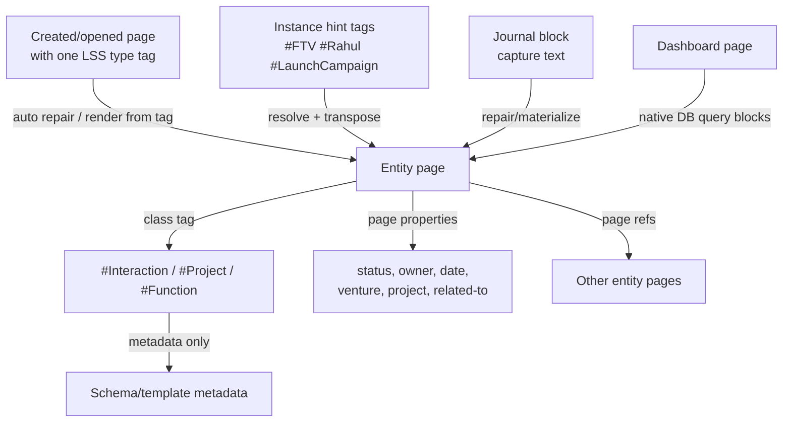

# LSS DB White Paper

## Building a Typed Knowledge Graph in Logseq DB

Version: 2026-06-26
Repository: `AshutoshMahindru/lss-db`
Plugin: `logseq-lss-db-final-plugin` v2.0.15

## Executive Summary

LSS DB is a Logseq DB plugin and schema pack for building a typed personal and operational knowledge graph. It treats pages as durable entities, DB tags as class/type labels, and page properties as the canonical place for facts, states, dates, ownership, and relationships.

The current operating model is tag-first:

```text
Create/open page
Add one primary LSS type tag
Optionally add instance hint tags for related pages
Let LSS render the page from the tag
Run lss: materialise page only when explicit repair/sync is needed
```

The system is intentionally not a folder hierarchy. It is a typed graph:

- A page's class tag says what the page is.
- A page's properties say what is known about the page.
- Relationship properties connect pages to other pages.
- Journal blocks are capture surfaces, not durable entity records.
- Templates are layout and query scaffolds, not schema sources.
- Dashboards and entity sections are query-backed graph views.

`lss: materialise page` is still important, but its role is repair and synchronization: stale pages, legacy journal captures, incomplete native query blocks, and pages whose registry contract has drifted.

## The Problem Being Solved

Logseq is excellent for capture, linking, and block-level thinking. Logseq DB adds typed properties and tags, but the default behavior can become noisy if tags are used as both class labels and schema carriers. When native tag properties are attached to `#Function`, `#Project`, `#Interaction`, or other LSS class tags, Logseq can render those properties on journal blocks as soon as the tag is used.

LSS needs these workflows without polluting journals:

- Capture a meeting in a journal.
- Relate it to a person, project, venture, topic, decision, and action items.
- See the same record from every related entity page.
- Keep entity pages structured and query-backed.
- Avoid duplicating schema in tags, templates, page bodies, and setup pages.

The main design challenge is separating capture, classification, entity data, and graph relationships.

## Core Design Principle

Use this rule:

```text
#PrimaryLssTypeTag = what kind of thing this page is
#InstanceHintTag = shorthand for another page/entity related to this page
property:: value = fact or relationship about this thing
[[Page]] = graph node / entity reference
```

For example:

```text
Rahul - Launch Campaign Meeting
#Interaction
#FTV
#LaunchCampaign
#Rahul

lss-object-type:: Interaction
participants:: [[Rahul]], [[Ashutosh]]
related-to:: [[FTV]], [[Launch Campaign]], [[Pricing]]
venture:: [[FTV]]
project:: [[Launch Campaign]]
date:: 20260620
status:: captured
```

The page is an `Interaction`. It is not also a `Person`, `Project`, and `Venture`. Those are related entities. Additional tags such as `#FTV`, `#LaunchCampaign`, or `#Rahul` are input hints. Rendering or materialization may transpose them into relationship properties and sections, but the durable graph model is page refs in properties, not multiple class identities.

## Conceptual Architecture



LSS has four major surfaces:

1. Capture surface: journals and ordinary blocks.
2. Entity surface: durable pages with class tags and page properties.
3. Schema/control surface: generated schema, template, tag, relationship, and command pages.
4. Dashboard surface: query-backed views over typed entities.

## Canonical Area Model

The generated `LSS Area Model` page renders the high-level ontology as a navigable graph map. It keeps canonical registry names stable while exposing user-facing aliases where operating language differs from stored schema.

The core area set is:

```text
Area/Health
Area/Wealth
Area/Learning
Area/Family
Area/Friends
Area/Work
Area/Pursuits
Area/Cross-Cutting
```

Work currently includes:

```text
Entity-Page/Venture
Entity-Page/Function
Entity-Page/Project
Entity-Page/Work-Stream
```

Cross-cutting entities include:

```text
Entity-Page/Person
Entity-Page/Document
Entity-Page/Notebook
Entity-Page/Organisation
Entity-Page/File
Entity-Page/Output
Entity-Page/Report
Entity-Page/Proposal
Entity-Page/Presentation
Entity-Page/SOP
Entity-Page/Essay
Entity-Page/ResearchBrief
```

Forms are capture and event records. They can be block-first or page-materialized depending on use:

```text
Form/Interaction
Form/Question
Form/Insight
Form/Idea
Form/Decision
Form/Work-Stream
Form/Action-Item
Form/Note
Form/Review
Form/Daily-Review
Form/Weekly-Review
Form/Monthly-Review
Form/Important-Date
Form/Commitment
Form/Event
```

Word extenders support vocabulary, naming, shorthand, prompt reuse, and query reuse:

```text
Word Extender/Term
Word Extender/Phrase
Word Extender/Prompt Fragment
Word Extender/Abbreviation
Word Extender/Naming Rule
Word Extender/Style Rule
Word Extender/Alias
Word Extender/Domain Vocabulary
Word Extender/Query Snippet
```

## Tags, Properties, and Metadata

### Class Tags

Class tags classify a page or block.

Examples:

```text
#Venture
#Function
#Project
#Person
#Organisation
#Interaction
#Decision
#ActionItem
#Question
#Insight
#Idea
#Document
#Review
```

Correct usage:

```text
Launch Campaign
#Project
```

Incorrect usage:

```text
Rahul - Launch Campaign Meeting #Interaction #Person #Project #Venture
```

That says the meeting is a person, project, and venture. It is not. It is an interaction related to those entities.

### Page Properties

Page properties are the canonical place for entity data:

```text
status:: active
owner:: [[Ashutosh]]
venture:: [[FTV]]
project:: [[Launch Campaign]]
participants:: [[Rahul]], [[Ashutosh]]
related-to:: [[FTV]], [[Launch Campaign]], [[Pricing]]
review-date:: [[Jun 26th, 2026]]
```

These properties belong on the entity page, not on the native Logseq tag.

### Native Tag Metadata

Native tag metadata should describe the tag/class itself, not the instances.

Safe metadata for `#Interaction`:

```text
lss-kind:: entity-class
schema-page:: [[Entity-Page/Interaction]]
template:: [[Template/Interaction]]
description:: A meeting, call, message, or exchange.
lss-managed-by:: lss-db
schema-version:: 1.0.0
```

Do not bind these as native tag properties:

```text
status
owner
venture
project
participants
review-date
priority
stage
confidence
```

Why: Logseq displays native tag properties on every tagged block, including journal blocks. LSS does not want journal capture blocks to become full entity records.

## Current Coded Policy

The repository encodes this policy:

```text
1. Native tags are class labels.
2. Native tag properties are not used for LSS entity schema fields.
3. The primary page UX is: create/open page -> tag one LSS type -> page renders from the tag.
4. Entity schema fields are rendered or repaired onto entity pages by auto-repair and materialization.
5. Additional non-primary tags may be consumed as instance hints, not class labels.
6. Templates are layout and query scaffolds only.
7. Journal captures are cleaned after materialization.
8. Dashboards query entity pages through native Logseq DB query blocks.
```

The renderer/materializer is generic. It should work for any registered area, entity, form, or word-extender page type in `src/registry/data.json`:

```text
New or existing page
#OnePrimaryLssType
#OptionalInstanceHint
#AnotherOptionalInstanceHint

auto repair: render page from tag
manual fallback: lss: materialise page
```

## Entity Page Model

Every durable LSS entity page has:

```text
1. One primary class tag.
2. lss-object-type for compatibility and fallback detection.
3. Page properties for facts and relationships.
4. Optional native sections and query-backed sections.
```

The renderer should infer the object type from the primary LSS tag and then generate or repair the instance artifacts for that page:

- Apply or confirm the native class tag on the page.
- Set `lss-object-type`.
- Render or repair all `requiredProperties` and registered optional properties from the matching `RegistryObject`.
- Fill safe default values from the registry.
- Infer contextual relationship properties from current page context and instance hint tags where possible.
- Use managed placeholder refs when a node relationship cannot be inferred.
- Insert or repair layout sections from the matching registry template.
- Insert or repair query-backed sections.
- Preserve user-authored notes and child blocks.

If the current page has no LSS type tag, or has multiple primary LSS type tags, rendering/repair must stop and ask the user to choose exactly one type. It should not guess silently.

## Placeholder Policy

Node-valued properties need concrete page refs for Logseq DB to preserve field shape and selector behavior. When LSS cannot infer a real target, it writes a managed placeholder page ref:

```text
venture:: [[LSS Placeholder - Venture]]
related-project:: [[LSS Placeholder - Project]]
owner:: [[LSS Placeholder - Person]]
related-to:: [[LSS Placeholder - related-to]]
```

These placeholders are necessary. They keep typed fields visible and selectable on freshly rendered pages, especially when a relationship is optional or cannot be inferred from context.

Placeholders are intentionally not auto-removed just because a real entity is added. Auto-removal is risky in Logseq DB because the plugin cannot always know whether:

- The placeholder is still being used as a deliberate selector value.
- The UI has persisted the user's new choice.
- A delayed sync is still in flight.

The preferred workflow is manual and explicit:

```text
1. Open the property selector.
2. Select the real entity.
3. Uncheck the placeholder value.
```

This mirrors the `related-to` workflow and should be consistent across all placeholder-backed relationship fields.

## Relationship Properties

Use explicit relationship properties when the edge has a strong meaning:

| Property | Typical Target |
|---|---|
| `venture` | `#Venture` |
| `function` | `#Function` |
| `project` | `#Project` |
| `workstream` | `#WorkStream` |
| `participants` | `#Person`, sometimes `#Organisation` |
| `owner` | `#Person` |
| `assigned-to` | `#Person` |
| `stakeholders` | `#Person`, `#Organisation` |
| `decisions` | `#Decision` |
| `actions` | `#ActionItem` |
| `outputs` | `#Output`, `#Document`, `#File` |
| `depends-on` | any relevant entity |
| `blocks` | any relevant entity |

Use `related-to` when the relationship is associative or does not deserve a more specific field. Specific relationship fields should render before the generic `related-to` field in the property panel.

## Templates and Managed Sections

Templates are layout and query scaffolds only. They should contain:

- Title/section structure.
- Native sections.
- Query sections grouped under managed headings.
- Empty notes/action/decision areas.

They should not contain schema property lines as ordinary visible content.

The current managed page-section order is:

```text
NATIVE SECTIONS
RELATED ENTITIES
GENERIC ENTITIES
FORMS
REVIEWS
DATES
```

`PROPERTIES` is obsolete as a rendered body section because Logseq DB page properties already appear in the native property panel.

Query sections are generated from the registry rather than hand-maintained in templates. For an entity page they should include:

- Same-family entity types: parents, children, and siblings in the current area.
- Generic cross-cutting entity types, such as `Person`, `Organisation`, and `Document`.
- All form types that can relate to the current entity.
- Review and date-oriented views where applicable.

The generator must dedupe by source type and view intent so a page does not show duplicate query sections for the same source type.

## Page and Journal Materialization

`lss: materialise page` is the explicit repair and synchronization command. It is not required for the happy-path case where a page renders correctly after the user adds one primary LSS type tag.

When run on an area/entity/form/word-extender page, materialization:

1. Reads the page's primary LSS type tag.
2. Collects additional non-primary tags as instance hints.
3. Applies or confirms the primary class tag on the page.
4. Writes `lss-object-type`.
5. Writes registry-backed page properties for the selected type.
6. Resolves instance hints to existing pages or confirmed aliases.
7. Maps resolved hints to relationship properties using the registry relationship graph.
8. Writes managed placeholder refs for unresolved node relationships.
9. Inserts or repairs native and query sections.
10. Cleans visible schema property lines and stale managed property values.
11. Repairs dashboard/query blocks and linked parent dashboards.

Materialization must be non-destructive once a renderable query exists. If a query block already has the native `#Query` tag, a `logseq.property/query` value, and an EDN-bearing query child, repair should preserve it and only fill missing metadata where possible.

Auto-repair and manual materialization must not race each other. Manual materialization should clear pending auto-repair for the current page at start, and auto-repair should defer while a manual repair session is active.

When run on a journal page, materialization should:

1. Remove LSS entity schema properties from native tags where possible.
2. Find journal blocks tagged with LSS entity class tags.
3. Collect non-primary tags on those blocks as instance hints.
4. Derive or create an entity page name.
5. Ensure page-level properties on the entity page.
6. Apply the class tag to the entity page.
7. Resolve and transpose instance hints into relationship properties and sections.
8. Copy useful block content/children to the entity page.
9. Clean visible schema property lines after promotion.
10. Replace the original journal block with a clean page link.

## Native DB Query Architecture

Dashboard and entity-page query sections use Logseq DB's native query block shape. The visible block is the query block, not a wrapper heading above a query.

```text
Visible query block titled "Function"
  - has native Query tag
  - has logseq.property/query pointing to a query value/code child
  - has child block containing the EDN query payload
```

For DB graphs, the canonical query payload is an EDN advanced query map. For relationship filters, the query body should be Datalog because the Logseq DSL `property` operator is unreliable for DB node-reference properties.

Example shape:

```clojure
{:title "Function"
 :query [:find (pull ?b [*])
         :where
         (or [?b :block/tags ?tag]
             [?b :blocks/tags ?tag])
         (or [?tag :block/title "Function"]
             [?tag :block/name "function"])
         [?b :plugin.property.logseq-lss-db-final-plugin/venture 12843]]}
```

When the current page id cannot be resolved at generation time, the query may use the native current-page input:

```clojure
{:title "Function"
 :query [:find (pull ?b [*])
         :in $ ?current
         :where
         [?b :plugin.property.logseq-lss-db-final-plugin/venture ?current]]
 :inputs [:current-page]}
```

The canonical DB query block path is:

```text
Parent block:
  visible title from the source type or view section
  native #Query tag
  logseq.property/query -> child query block id

Child query block:
  EDN map
  logseq.property/created-from-property = query
  logseq.property.node/display-type = :code
  logseq.property.code/lang = clojure
```

Raw EDN in the parent query property is not a durable native DB query shape and must be rewritten into the child block. Empty `logseq.property/query` trigger values should be avoided because they create late-write races where a query appears briefly and then collapses or disappears.

Keyword-typed DB properties must be written as Clojure keywords through the host API. Writing string values such as `"code"` where Logseq expects `:code` can produce:

```text
Property "Property type" has invalid value: should be a Clojure keyword
```

Query and heading blocks should be expanded through `set_block_collapsed(..., false)` where the API is available. Repair should not depend on writing a `block/collapsed?` property as ordinary data.

The diagnostic signal for a healthy relationship query is:

```text
query-match:: yes
query-needs-repair:: no
query-block-has-query-tag:: yes
query-block-has-query-property:: yes
query-child-created-from-query:: yes
query-child-display-type-code:: yes
live-query-stored:: >0 when matching pages exist
```

## Setup Commands

Run either:

```text
lss: 1setup-all
```

or step by step:

```text
lss: 2setup-bootstrap
lss: 3setup-areas
lss: 4setup-schema-pages
lss: 5setup-db-tags
lss: 6setup-tag-properties
lss: 7setup-relationships
lss: 8setup-templates
lss: 9setup-dashboards
lss: 10setup-word-extenders
lss: 11setup-db-native-config
lss: 12setup-page-tree
lss: 13verify-schema
```

Important maintenance commands:

| Command | Responsibility |
|---|---|
| `lss: materialise page` | Repair/sync current tagged page or journal captures |
| `lss: 34audit-graph` | Run graph-level verification and native tag schema pollution summary |
| `lss: 51diagnose-current-page` | Write a detailed diagnostic report |
| `lss: 54clean-native-tag-schema-properties` | Remove LSS registry schema properties from native tag property lists |
| `lss: 57repair-related-to-display-order` | Repair native property order so specific relationship fields render before `related-to` |

## Operational Guidance

### Capturing

Prefer lightweight journal capture:

```text
- Met [[Rahul]] about [[Launch Campaign]] for [[FTV]].
```

Only tag the capture as an entity when it should become durable:

```text
- Rahul - Launch Campaign Discussion #Interaction
```

Then run `lss: materialise page` on the journal page to create/update the durable entity page and replace the journal capture with a clean page link.

### Creating Areas, Entities, and Page-Materialized Forms

Create or open the page, then add one primary LSS type tag:

```text
Launch Campaign
#Project
#FTV
#Marketing
```

The happy path is automatic rendering from the tag. Run `lss: materialise page` only when the page is stale, incomplete, or has query blocks that are not rendering.

### Relating Entities

Use properties as the final graph model:

```text
participants:: [[Rahul]], [[Ashutosh]]
project:: [[Launch Campaign]]
venture:: [[FTV]]
related-to:: [[Pricing]]
```

Instance hint tags are allowed as creation shorthand:

```text
Rahul - Launch Campaign Discussion
#Interaction
#Rahul
#LaunchCampaign
#FTV
```

Rendering or materialization should resolve those hints and write relationship properties. The durable record should be driven by properties and page refs, not by the hint tags.

## Invariants

The coded setup should maintain these invariants:

```text
1. Native entity tags do not own LSS instance schema properties.
2. Entity pages own instance properties.
3. Templates are layout/query scaffolds, not property sources.
4. Tag-driven rendering is the primary workflow step that turns a typed page into a complete LSS record.
5. Page and journal block bodies do not retain durable entity schema fields after repair/materialization.
6. Dashboards query entity pages through class tags and relationship properties.
7. Relationships are page references, not string labels.
8. Query blocks are repaired to the canonical native DB shape: #Query parent, query property, EDN child.
9. A page must have exactly one primary LSS type tag before rendering/repair proceeds.
10. Additional instance hint tags are transposed into relationship properties and sections, not treated as extra class identities.
11. Placeholder refs are intentional selector anchors and are removed by explicit user uncheck, not by automatic guessing.
12. Specific relationship fields render before the generic related-to field.
13. Related query sections include parent, child, and sibling types plus generic entities, forms, reviews, and dates.
14. Managed query sections are deduped by source type and view intent.
```

## Troubleshooting

### Tag properties visible on journals

Run:

```text
lss: 11setup-db-native-config
```

Then repair affected journal pages with:

```text
lss: materialise page
```

### Related query shows zero results

Check that the relationship value is a page ref, not a text string. For DB node-reference relationships, the generated query should be Datalog and should compare against the current page id or `:inputs [:current-page]`.

### Query appears and then disappears

Repair should convert raw or incomplete query blocks into the native shape:

```text
#Query parent
logseq.property/query child ref
EDN child
display-type :code
code/lang clojure
```

Avoid empty `logseq.property/query` trigger writes and avoid destructive rebuild once this shape exists.

### Placeholder persists after selecting a real entity

This is expected. Open the selector and uncheck the placeholder explicitly.

## Implementation Map

```text
src/modules/setup.ts       native tag/property setup and tag-property cleanup
src/modules/templates.ts   native template installation and layout-only templates
src/modules/repair.ts      page/journal materialization and page property repair
src/modules/repair-dashboard.ts
                         dashboard query repair runner and linked parent dashboard refresh
src/modules/queries.ts     public facade over split query modules
src/modules/query-builders.ts
                         dashboard/simple/advanced query generation with Datalog DB relationship filters
src/modules/query-edn.ts  query content normalization, equivalence, and repair drift checks
src/modules/query-probes.ts
                         Datascript probe helpers for query/path diagnostics
src/modules/dashboard-query-repair.ts
                         query-block discovery, content reads, scoring, and canonical selection
src/modules/dashboard-query-views.ts
                         registry/template view derivation for dashboard sections
src/modules/advanced-query-blocks.ts
                         Logseq DB #Query adapter and host-scope repair boundary
src/modules/diagnose.ts    current-page diagnostic report assembly
src/modules/native-tag-cleanup.ts
                         dedicated native tag schema cleanup command
src/registry/data.json     schema registry and command/audit metadata
```

## Summary

LSS DB is a typed graph system layered onto Logseq DB. The current coded setup is designed around a clean separation:

```text
Tags classify.
Instance hint tags provide shorthand input.
Page properties describe and relate.
Templates structure.
Journals capture.
Tag-driven rendering generates the complete typed page.
Materialization repairs legacy captures, stuck query blocks, and drift.
Dashboards query through native DB query blocks.
```

This separation prevents journal pollution, preserves flexible graph relationships, and allows the same entity or event to appear naturally from multiple perspectives without forcing everything into a hierarchy.
