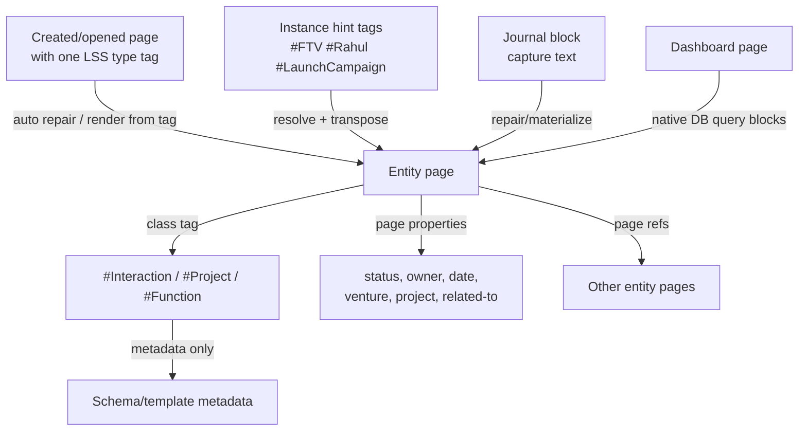
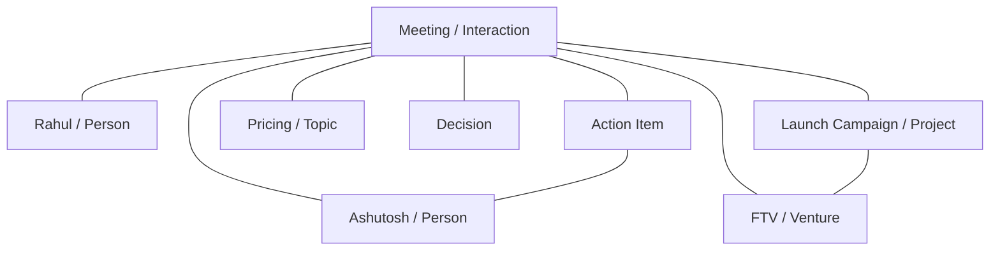

# LSS DB White Paper

## Building a Typed Knowledge Graph in Logseq DB

Version: 2026-06-26
Repository: `AshutoshMahindru/lss-db`
Plugin: `logseq-lss-db-final-plugin` v2.0.15

## Executive Summary

LSS DB is a Logseq DB plugin and schema pack for building a typed personal and operational knowledge graph. It treats Logseq pages as durable entities, Logseq DB tags as class/type labels, and page properties as the canonical place for facts, states, dates, ownership, and relationships.

The system is intentionally not a folder hierarchy. It is a typed graph:

- A page's class tag says what the page is.
- A page's properties say what is known about the page.
- Relationship properties connect pages to other pages.
- Journal blocks are capture surfaces, not durable entity records.
- The primary UI workflow is: create/open a page, add one LSS type tag, and let LSS render the page from that tag.
- `lss: materialise page` is the explicit repair/sync command for drift, legacy pages, journal captures, or stuck query blocks.
- Dashboards are query-backed graph views over typed entities.

The current implementation has moved away from native Logseq tag properties as the entity schema source because Logseq renders native tag properties on any tagged block. That behavior pollutes journal pages when a user tags a capture block with `#Function`, `#Project`, `#Interaction`, or another LSS entity class. The coded setup now removes LSS entity schema fields from native tags and materializes those fields onto entity pages instead.

## The Problem Being Solved

Logseq is excellent for capture, linking, and block-level thinking. Logseq DB adds typed properties and tags, but the default behavior can become noisy when tags are used as both class labels and property schema carriers.

LSS needs to support workflows like:

- Capture a meeting in a journal.
- Relate it to a person, project, venture, topic, decision, and action items.
- See the same meeting from the person page, project page, venture page, and review dashboards.
- Keep journal pages readable.
- Keep entity pages structured.
- Avoid duplicating properties in templates, tags, and page bodies.

The main design challenge is separating capture, classification, entity data, and graph relationships.

## Core Design Principle

Use this rule:

```text
#PrimaryLssTypeTag = what kind of thing this page is
#InstanceHintTag = shorthand for another page/entity related to this page
property:: value = fact or relationship about this thing
[[Page]] = graph node / entity reference
```

For example:

```text
Rahul - Launch Campaign Meeting
#Interaction
#FTV
#LaunchCampaign
#Rahul

lss-object-type:: Interaction
participants:: [[Rahul]], [[Ashutosh]]
related-to:: [[FTV]], [[Launch Campaign]], [[Pricing]]
venture:: [[FTV]]
project:: [[Launch Campaign]]
date:: 20260620
status:: captured
```

The page is an `Interaction`. It is not a `Person`, `Project`, and `Venture`
at the same time. Those are related entities. During materialization, additional
instance hint tags such as `#FTV`, `#LaunchCampaign`, or `#Rahul` may be resolved
to existing pages and transposed into page properties and relevant sections.
After transposition, the durable graph model is still relationship properties
and page refs, not multiple class tags.

## Conceptual Architecture



LSS has four major surfaces:

1. Capture surface: journals and ordinary blocks.
2. Entity surface: durable pages with class tags and page properties.
3. Schema/control surface: generated schema, template, tag, relationship, and command pages.
4. Dashboard surface: query-backed views over typed entities.

## Canonical Area Model

The generated `LSS Area Model` page renders the high-level ontology as a navigable graph map. It keeps canonical registry names stable while exposing user-facing aliases where the operating language differs from the stored schema.

### Areas

```text
Area/Health
Area/Wealth
Area/Learning
Area/Family
Area/Friends
Area/Work
Area/Pursuits
Area/Cross-Cutting
```

### Entities by Area

#### 🏥 Health

```text
Entity-Page/Regime     — Health related action system
Entity-Page/Diet       — Dietary protocol
Entity-Page/Exercise   — Physical workout
Entity-Page/Condition  — Diagnosed health condition
Entity-Page/Therapy    — Ongoing therapy
Entity-Page/Treatment  — Treatment course
Entity-Page/Medicine   — Specific medication
```

#### 🪙 Wealth

```text
Entity-Page/Account
Entity-Page/FinancialAsset — displayed as Asset; canonical name remains FinancialAsset
```

`FinancialAsset` is intentionally not renamed to `Asset` because Logseq has built-in and common usage around asset-like concepts. LSS keeps the canonical tag/page stable and exposes `Asset` as a display alias.

#### 📚 Learning

```text
Entity-Page/Subject   — Knowledge domain
Entity-Page/Course    — Structured learning program
Entity-Page/Lesson    — Discrete learning session
Entity-Page/Concept   — Specific idea within a subject
Entity-Page/Skill     — Capability being built
Entity-Page/Ability   — Capacity or developed ability
```

#### 🏠 Family

Family does not introduce a separate entity class in this pass. It uses cross-cutting `Person`, `Document`, `Interaction`, `Event`, `Commitment`, `Note`, and related forms with contextual tags and matching properties:

```text
#family-relation/parent
#family-relation/child
#family-relation/sibling
#family-relation/partner
#family-relation/extended-family
#family-relation/household

family-relation:: parent / child / sibling / partner / extended-family / household
```

#### 👥 Friends

Friends also uses cross-cutting `Person` and forms. Closeness is modeled both as contextual tags and as a structured page property:

```text
#closeness/inner-circle
#closeness/close
#closeness/regular
#closeness/acquaintance
#closeness/dormant

closeness:: inner-circle / close / regular / acquaintance / dormant
```

#### 💼 Work

```text
Entity-Page/Venture      — Business you own/run
Entity-Page/Function     — Business function
Entity-Page/Project      — Bounded effort
Entity-Page/Work-Stream  — WorkStream, canonical registry name WorkStream
```

Work roles are contextual tags plus structured relationship fields:

```text
#org-role/founder
#org-role/owner
#org-role/employee
#org-role/contractor
#org-role/advisor
#org-role/investor
#org-role/customer
#org-role/vendor
#org-role/regulator
#org-role/partner

role::
relationship-context::
```

#### 🧭 Pursuits

```text
Entity-Page/Pursuit
```

#### 🌐 Cross-Cutting Entities and Artifacts

Core cross-cutting entities:

```text
Entity-Page/Person        — Individual human
Entity-Page/Document      — Contracts, decks, filings, policies
Entity-Page/Notebook      — Curated thematic collection of notes
Entity-Page/Organisation  — Companies, institutions, regulators, etc.
```

Extended cross-cutting artifact types already present in the registry:

```text
Entity-Page/File
Entity-Page/Output
Entity-Page/Report
Entity-Page/Proposal
Entity-Page/Presentation
Entity-Page/SOP
Entity-Page/Essay
Entity-Page/ResearchBrief
```

Confidentiality can be used across Wealth, Work, Health, and personal records:

```text
#confidential/public
#confidential/internal
#confidential/private
#confidential/financial
#confidential/legal
#confidential/medical

confidentiality:: public / internal / private / financial / legal / medical
```

### Forms

Forms are capture and event records. They can be block-first or page-materialized depending on use:

```text
Form/Interaction
Form/Question
Form/Insight
Form/Idea
Form/Decision
Form/Work-Stream        — display alias for canonical WorkStreamUpdate
Form/Action-Item
Form/Note
```

The registry also includes review and date-oriented forms:

```text
Form/Review
Form/Daily-Review
Form/Weekly-Review
Form/Monthly-Review
Form/Important-Date
Form/Commitment
Form/Event
```

### Word Extenders

Word extenders support vocabulary, naming, shorthand, prompt reuse, and query reuse:

```text
Word Extender/Term
Word Extender/Phrase
Word Extender/Prompt Fragment
Word Extender/Abbreviation
Word Extender/Naming Rule
Word Extender/Style Rule
Word Extender/Alias
Word Extender/Domain Vocabulary
Word Extender/Query Snippet
```

The area hierarchy seeds `DomainVocabulary` pages, object types seed `NamingRule` pages, common property names seed `Abbreviation` pages, and dashboard views seed `QuerySnippet` pages.

## Tags, Properties, and Metadata

### Class Tags

Class tags classify a page or block.

Examples:

```text
#Venture
#Function
#Project
#Person
#Organisation
#Interaction
#Decision
#ActionItem
#Question
#Insight
#Idea
#Document
#Review
```

Correct usage:

```text
Launch Campaign
#Project
```

Incorrect usage:

```text
Rahul - Launch Campaign Meeting #Interaction #Person #Project #Venture
```

That says the meeting is a person, project, and venture. It is not. It is an interaction related to those entities.

### Primary Type Tags and Instance Hint Tags

LSS distinguishes two tag roles during materialization:

```text
Primary type tag:    #Interaction
Instance hint tags:  #Rahul #LaunchCampaign #FTV
```

There must be exactly one primary LSS type tag on a page that is being
materialized automatically. The primary tag determines the page's schema.

Additional tags may be used as instance hints when they name or alias existing
pages. These are temporary input shortcuts, not additional class identities. The
materializer should resolve them to page refs, write the appropriate relationship
properties, and transpose them into matching sections where useful.

Example materialization input:

```text
Rahul - Launch Campaign Meeting
#Interaction
#Rahul
#LaunchCampaign
#FTV
```

Expected durable result:

```text
Rahul - Launch Campaign Meeting
#Interaction

participants:: [[Rahul]]
project:: [[Launch Campaign]]
venture:: [[FTV]]
related-to:: [[Rahul]], [[Launch Campaign]], [[FTV]]
```

The final record remains an `Interaction`, not a `Person`, `Project`, or
`Venture`.

### Page Properties

Page properties are the canonical place for entity data:

```text
status:: active
owner:: [[Ashutosh]]
venture:: [[FTV]]
project:: [[Launch Campaign]]
participants:: [[Rahul]], [[Ashutosh]]
related-to:: [[FTV]], [[Launch Campaign]], [[Pricing]]
review-date:: [[Jun 20th, 2026]]
```

These properties belong on the entity page, not on the native Logseq tag.

### Meta Tag Properties

Native tag metadata should describe the tag/class itself, not the instances.

Safe metadata for `#Interaction`:

```text
lss-kind:: entity-class
schema-page:: [[Entity-Page/Interaction]]
template:: [[Template/Interaction]]
description:: A meeting, call, message, or exchange.
lss-managed-by:: lss-db
schema-version:: 1.0.0
```

Do not bind these as native tag properties:

```text
status
owner
venture
project
participants
review-date
priority
stage
confidence
```

Why: Logseq will display native tag properties on every tagged block, including journal blocks. LSS does not want journal capture blocks to become full entity records.

## Current Coded Policy

The repository now encodes this policy:

```text
1. Native tags are class labels.
2. Native tag properties are not used for LSS entity schema fields.
3. The primary page UX is: create/open page -> tag one LSS type -> page renders from the tag.
4. Entity schema fields are rendered or repaired onto entity pages by auto-repair and materialization.
5. Additional non-primary tags may be consumed as instance hints, not class labels.
6. Templates are layout and query scaffolds only.
7. Journal captures are cleaned after materialization.
8. Dashboards query entity pages through native Logseq DB query blocks.
```

The tag-driven renderer and materialization command are intentionally generic.
They should work for any registered area/entity/form/word-extender page type in
`src/registry/data.json`:

```text
New or existing page
#OnePrimaryLssType
#OptionalInstanceHint
#AnotherOptionalInstanceHint

auto repair: render page from tag
manual fallback: lss: materialise page
```

The page renderer infers the type from the page tag, writes the registry-backed
page properties, inserts or repairs layout/query sections, and cleans stale
managed properties. A user should not have to run type-specific commands for
ordinary entity creation, and should not have to run `lss: materialise page`
when tag-driven rendering has already completed.

Additional tags on the page are interpreted as instance hints only if they are
not LSS type tags and can be resolved to existing area/entity/form pages or safe
aliases. The renderer/materializer should use the registry relationship graph to
map those resolved pages into specific relationship properties such as `venture`,
`project`, `participants`, `function`, `subject`, `condition`, or `related-to`.
Where the template contains a matching section, it should also transpose those
refs into that section for human-readable context.

If an instance hint cannot be resolved, or resolves to multiple possible pages,
the renderer/materializer should report it and ask for confirmation rather than
writing a wrong relationship.

This is a per-page rendering and materialization workflow. Global scaffold
artifacts such as schema pages, tag contract pages, relationship pages,
dashboard contract pages, and native property definitions are still created once
by setup commands.

In code, this is implemented mainly in:

```text
src/modules/setup.ts       native tag/property setup and tag-property cleanup
src/modules/templates.ts   native template installation and layout-only templates
src/modules/repair.ts      page/journal materialization and page property repair
src/modules/repair-dashboard.ts
                         dashboard query repair runner and linked parent dashboard refresh
src/modules/queries.ts     public facade over the split query modules
src/modules/query-builders.ts
                         dashboard/simple/advanced query generation with current-page fallbacks
src/modules/query-edn.ts  query content normalization, equivalence, and repair drift checks
src/modules/query-probes.ts
                         Datascript probe helpers for query/path diagnostics
src/modules/dashboard-query-repair.ts
                         query-block discovery, content reads, scoring, and canonical selection
src/modules/dashboard-query-views.ts
                         registry/template view derivation for dashboard sections
src/modules/advanced-query-blocks.ts
                         Logseq DB #Query adapter and host-scope repair boundary
src/modules/diagnose.ts    current-page diagnostic report assembly
src/modules/diagnose-journal.ts
                         journal materialization status diagnostics
src/modules/diagnose-native-tags.ts
                         native tag schema pollution diagnostics
src/modules/diagnose-query-probes.ts
                         live query and Datascript probe helpers for diagnostics
src/modules/native-tag-cleanup.ts
                         dedicated native tag schema cleanup command
src/registry/data.json     schema registry and command/audit metadata
```

## Command Setup Sequence

The plugin exposes numbered commands. The setup sequence is:

```text
lss: 1setup-all
```

or step by step:

```text
lss: 2setup-bootstrap
lss: 3setup-areas
lss: 4setup-schema-pages
lss: 5setup-db-tags
lss: 6setup-tag-properties
lss: 7setup-relationships
lss: 8setup-templates
lss: 9setup-dashboards
lss: 10setup-word-extenders
lss: 11setup-db-native-config
lss: 12setup-page-tree
lss: 13verify-schema
```

The important DB-native command is:

```text
lss: 11setup-db-native-config
```

It now:

- Ensures native class tags exist.
- Ensures native properties exist where the plugin can own or register them.
- Adds tag inheritance where configured.
- Removes LSS entity schema fields from native tag property lists.

It does not add `status`, `venture`, `owner`, `review-date`, etc. to native entity tags.

## Entity Page Model

Every durable LSS entity page has:

```text
1. One primary class tag.
2. lss-object-type for compatibility and fallback detection.
3. Page properties for facts and relationships.
4. Optional layout sections and query-backed sections.
```

### Canonical Tag-First UX

The default user-facing workflow for any page-like LSS object is tag-first and
automatic. It is the same for areas, entities, forms that are page-materialized,
and word extenders:

```text
1. Create or open a page.
2. Add exactly one primary LSS type tag.
3. Optionally add one or more instance hint tags.
4. Let LSS render the page properties, native sections, and query sections.
5. Run lss: materialise page only when explicit repair/sync is needed.
```

Examples:

```text
FGPL
#Venture

expected: LSS renders Venture page structure from #Venture
```

```text
Sales
#Function

expected: LSS renders Function page structure from #Function
```

```text
Rahul - Launch Campaign Discussion
#Interaction
#FTV
#LaunchCampaign
#Rahul

expected: LSS resolves hints where possible and renders Interaction structure
```

After rendering or materialization, the durable entity should be equivalent to:

```text
Rahul - Launch Campaign Discussion
#Interaction

lss-object-type:: Interaction
participants:: [[Rahul]]
venture:: [[FTV]]
project:: [[Launch Campaign]]
related-to:: [[FTV]], [[Launch Campaign]], [[Rahul]]
```

The extra tags are input shorthand. They do not mean the page is also a
`Venture`, `Project`, or `Person`.

The renderer should infer the object type from the primary LSS tag and then
generate or repair the instance artifacts for that page:

- Apply or confirm the native class tag on the page.
- Set `lss-object-type`.
- Render or repair all `requiredProperties` and registered optional properties from the matching `RegistryObject`, or the equivalent registered area metadata for area pages.
- Fill default values from the registry.
- Infer contextual relationship properties from current page context and instance hint tags where possible.
- Use controlled flat-safe `LSS Placeholder - <target>` page refs when a node relationship cannot be inferred, so Logseq DB can still display the full page-property schema. The user may physically uncheck placeholders in selectors when replacing them with real entity refs.
- Insert or repair layout sections from the matching registry template.
- Insert or repair query-backed sections for dashboard-like templates.
- Transpose resolved instance hints into matching page sections where the template has an appropriate section.
- Remove, demote, or report consumed instance hint tags so they do not remain ambiguous class signals.
- Remove stale duplicate managed single-value properties before writing the canonical value.
- Preserve user-authored notes and child blocks.

Rendering or materialization should not regenerate global scaffold artifacts for
every page. Those belong to graph setup.

If the current page has no LSS type tag, or has multiple primary LSS type tags,
the command must stop and ask the user to choose exactly one type. It should not
guess silently.

Example:

```text
Marketing
#Function

lss-object-type:: Function
venture:: [[FTV]]
area:: [[Area - Work]]
status:: active
owner:: [[LSS Placeholder - Person]]
review-date:: [[Jun 20th, 2026]]
related-to:: [[LSS Placeholder - related-to]]

Notes
- ...

Projects
- query-backed section
```

## Universal Properties

These properties can apply across many entity types:

| Property | Meaning | Type |
|---|---|---|
| `lss-object-type` | Canonical object type | text/enum |
| `status` | Lifecycle state | enum |
| `area` | Life/work area | page ref |
| `owner` | Accountable person | page ref |
| `created-on` | Creation/capture date | date |
| `review-date` | Next review date | date |
| `source` | Source page/document/system | ref/text |
| `confidence` | Confidence level | enum |
| `visibility` | Access/privacy level | enum |
| `related-to` | General graph edge | page refs |

`related-to` is the escape valve for graph links that do not deserve a more specific relationship.

### Placeholder Policy

Node-valued properties need concrete page refs for Logseq DB to preserve the
field shape and show the correct selector behavior. When LSS cannot infer a
real target, it writes a managed placeholder page ref:

```text
venture:: [[LSS Placeholder - Venture]]
related-project:: [[LSS Placeholder - Project]]
owner:: [[LSS Placeholder - Person]]
related-to:: [[LSS Placeholder - related-to]]
```

These placeholders are necessary. They keep typed fields visible and selectable
on freshly rendered pages, especially when a relationship is optional or cannot
be inferred from context.

Placeholders are intentionally not auto-removed just because a real entity is
added. Auto-removal is risky in Logseq DB because the plugin cannot always know
whether the placeholder is still being used as a deliberate selector value,
whether the UI has persisted the user's new choice, or whether a delayed sync is
still in flight. The preferred workflow is manual and explicit:

```text
1. Open the property selector.
2. Select the real entity.
3. Uncheck the placeholder value.
```

This mirrors the `related-to` workflow and should be consistent across all
placeholder-backed relationship fields.

## Relationship Properties

Use explicit relationship properties when the edge has a strong meaning:

| Property | Typical Target |
|---|---|
| `venture` | `#Venture` |
| `function` | `#Function` |
| `project` | `#Project` |
| `workstream` | `#WorkStream` |
| `participants` | `#Person`, sometimes `#Organisation` |
| `owner` | `#Person` |
| `assigned-to` | `#Person` |
| `stakeholders` | `#Person`, `#Organisation` |
| `topics` | `#Topic`, `#Concept`, or ordinary pages |
| `decisions` | `#Decision` |
| `actions` | `#ActionItem` |
| `outputs` | `#Output`, `#Document`, `#File` |
| `depends-on` | any relevant entity |
| `blocks` | any relevant entity |

Use `venture` or `project` when that relationship is operationally meaningful. Use `related-to` when the relationship is associative.

## Typed Graph, Not Hierarchy

The graph should not be modeled as:

```text
Venture
  Project
    Meeting
      Person
```

It should be modeled as:



The same interaction can appear on:

- Rahul page.
- Ashutosh page.
- Launch Campaign page.
- FTV page.
- Pricing topic page.
- Weekly review.
- Open actions dashboard.

No single parent owns it.

## Worked Example: Meeting With a Person About a Project in a Venture

### Journal Capture

In the journal:

```text
- Met [[Rahul]] about [[Launch Campaign]] for [[FTV]]. Need to send campaign brief.
```

This is a simple capture. It does not need to become a full entity unless it is important.

If it should become a durable interaction:

```text
- Rahul - Launch Campaign Discussion #Interaction
```

### Materialized Entity Page

After repair/materialization:

```text
Rahul - Launch Campaign Discussion
#Interaction

lss-object-type:: Interaction
date:: 20260620
participants:: [[Rahul]], [[Ashutosh]]
related-to:: [[FTV]], [[Launch Campaign]]
venture:: [[FTV]]
project:: [[Launch Campaign]]
topics:: [[Marketing]], [[Pricing]]
status:: captured

Notes
- Met Rahul about the launch campaign.
- Need to send campaign brief.

Actions
- [[Send Rahul campaign brief]]
```

### Journal After Materialization

The journal should be cleaned to:

```text
- [[Rahul - Launch Campaign Discussion]]
```

It should not retain:

```text
participants::
project::
venture::
status::
review-date::
```

### Related Pages

The related pages remain separate typed entities:

```text
Rahul
#Person

lss-object-type:: Person
organisation::
status:: active
```

```text
Launch Campaign
#Project

lss-object-type:: Project
venture:: [[FTV]]
function:: [[Marketing]]
owner:: [[Ashutosh]]
status:: active
priority:: high
deadline::
```

```text
FTV
#Venture

lss-object-type:: Venture
status:: active
owner:: [[Ashutosh]]
stage:: build
```

## Entity Type Recommendations

The property lists below are registry/schema references. They describe what the
renderer/materializer should generate or repair on the page. They are not
instructions for users to type visible property lines into templates or page
bodies.

### Venture

Purpose: a long-running initiative, business, thesis, or strategic effort.

Recommended properties:

```text
lss-object-type:: Venture
status::
area::
owner::
stage::
start-date::
review-date::
related-to::
```

Useful query sections:

- Functions
- Projects
- Workstreams
- Interactions
- Decisions
- Open actions
- Documents/outputs

### Function

Purpose: an operational capability inside or across ventures.

```text
lss-object-type:: Function
venture::
area::
owner::
status::
review-date::
related-to::
```

Expected materialized sections:

```text
Purpose
Related venture
Responsibilities
Projects
Workstreams
Notes
```

Example:

```text
Marketing
#Function

venture:: [[FTV]]
status:: active
owner::
```

### Project

Purpose: a time-bound effort with outcomes.

```text
lss-object-type:: Project
venture::
function::
owner::
status::
priority::
start-date::
deadline::
review-date::
related-to::
```

### WorkStream

Purpose: a persistent lane of work, often inside a project or venture.

```text
lss-object-type:: WorkStream
venture::
project::
function::
owner::
status::
related-to::
```

### Person

Purpose: a person node.

```text
lss-object-type:: Person
status::
organisation::
role::
email::
phone::
related-to::
```

Interactions should be queried by:

```text
participants includes current page
```

not manually listed forever on the person page.

### Organisation

```text
lss-object-type:: Organisation
status::
website::
sector::
relationship-status::
people::
related-to::
```

### Interaction

Purpose: meeting, call, email, chat, conversation, or meaningful exchange.

```text
lss-object-type:: Interaction
interaction-type::
date::
participants::
related-to::
venture::
project::
topics::
outputs::
actions::
decisions::
status::
```

### Decision

```text
lss-object-type:: Decision
status::
decided-on::
decided-by::
related-to::
venture::
project::
rationale::
confidence::
```

### ActionItem

```text
lss-object-type:: ActionItem
status::
priority::
owner::
assigned-to::
due-date::
scheduled::
related-to::
venture::
project::
source::
```

### Question

```text
lss-object-type:: Question
status::
asked-on::
asked-by::
related-to::
venture::
project::
answer::
```

### Insight

```text
lss-object-type:: Insight
captured-on::
confidence::
related-to::
source::
```

### Idea

```text
lss-object-type:: Idea
status::
captured-on::
related-to::
confidence::
```

### Document / File / Output

```text
lss-object-type:: Document
status::
owner::
related-to::
venture::
project::
url::
source::
```

```text
lss-object-type:: Output
status::
owner::
related-to::
venture::
project::
delivered-on::
```

### Review

```text
lss-object-type:: Review
review-period::
date::
related-to::
outcomes::
actions::
decisions::
```

## Templates

Templates are layout and query scaffolds only.

They should contain:

- Title/section structure.
- Native sections.
- Query sections grouped under managed headings.
- Empty notes/action/decision areas.

They should not contain schema property lines as ordinary visible content.

Templates may be applied by tag-driven rendering or by the materialization
command, but they remain structural. The renderer/materializer writes real page
properties; the template contributes sections and query blocks.

The current managed page-section order is:

```text
NATIVE SECTIONS
RELATED ENTITIES
GENERIC ENTITIES
FORMS
REVIEWS
DATES
```

`PROPERTIES` is obsolete as a rendered body section because Logseq DB page
properties are already displayed in the native property panel. Relationship
properties should stay in that property panel, with specific relationship fields
shown before the generic `related-to` field.

Query sections are generated from the registry rather than hand-maintained in
templates. For an entity page they should include:

- Same-family entity types: parents, children, and siblings in the current area.
- Generic cross-cutting entity types, such as `Person`, `Organisation`, and `Document`.
- All form types that can relate to the current entity.
- Review and date-oriented views where applicable.

The generator must dedupe by source type and view intent so a page does not
show duplicate query sections for the same source type.

The code enforces this by:

- Stripping property lines out of template bodies.
- Sourcing default page properties from `RegistryObject` during creation or materialization.
- Disabling `Apply template to tags` for DB entity templates.
- Configuring native DB `#Query` blocks inside template sections.
- Repairing older visible schema-property mirror blocks by promoting the values to page properties and cleaning the duplicate content lines.

## Page and Journal Materialization

`lss: materialise page` is the explicit repair and synchronization command. It
is not required for the happy-path case where a page renders correctly after the
user adds one primary LSS type tag.

The command is still important. It repairs older materialized pages, unsticks
incomplete query blocks, cleans journal captures, and re-applies the registry
contract when a page has drifted.

When run on an area/entity/form/word-extender page, materialization:

1. Reads the page's primary LSS type tag.
2. Collects additional non-primary tags as instance hints.
3. Applies or confirms the primary class tag on the page.
4. Writes `lss-object-type`.
5. Writes the registry-backed page properties for the selected type.
6. Resolves instance hints to existing pages or confirmed aliases.
7. Maps resolved hints to relationship properties using the registry relationship graph.
8. Infers additional relationship properties from current page context where possible.
9. Writes managed placeholder refs for unresolved node relationships so the typed property remains visible and selectable.
10. Inserts or repairs layout and query sections from the matching template.
11. Transposes resolved hints into relevant sections where the section exists.
12. Cleans visible schema property lines and stale managed property values.
13. Removes, demotes, or reports consumed instance hint tags.
14. Repairs dashboard query blocks and linked parent dashboards.

Materialization must be non-destructive once a renderable query exists. If a
query block already has the native `#Query` tag, a `logseq.property/query` value,
and an EDN-bearing query child, repair should preserve it and only fill missing
metadata where possible. Missing display metadata is repairable; it is not a
reason to delete a working query and rebuild the page section from scratch.

Auto-repair and manual materialization must not race each other. Manual
materialization should clear pending auto-repair for the current page at start,
and auto-repair should defer while a manual repair session is active.

When run on a journal page, it:

1. Removes LSS entity schema properties from native tags where possible.
2. Finds journal blocks tagged with LSS entity class tags.
3. Collects non-primary tags on those blocks as instance hints.
4. Derives or creates an entity page name.
5. Ensures page-level properties on the entity page.
6. Applies the class tag to the entity page.
7. Resolves and transposes instance hints into relationship properties and sections.
8. Copies useful block content/children to the entity page.
9. Cleans visible schema property lines after they have been promoted.
10. Replaces the original journal block with a clean page link.

Before:

```text
- marketing #Function #FTV
  status:: active
  venture::
  review-date:: [[Jun 20th, 2026]]
```

After:

```text
- [[marketing]]
```

Entity page:

```text
marketing
#Function

lss-object-type:: Function
venture:: [[FTV]]
status:: active
review-date:: [[Jun 20th, 2026]]
```

## Native DB Query Architecture

Dashboard and entity-page query sections use Logseq DB's native query block
shape. The visible block is the query block, not a wrapper heading above a
query.

```text
Visible query block titled "Function"
  - has native Query tag
  - has logseq.property/query pointing to a query value/code child
  - has child block containing the EDN query payload
```

For DB graphs, the canonical query payload is an EDN advanced query map. For
relationship filters, the query body should be Datalog because the Logseq DSL
`property` operator is unreliable for DB node-reference properties.

Example shape:

```clojure
{:title "Function"
 :query [:find (pull ?b [*])
         :where
         (or [?b :block/tags ?tag]
             [?b :blocks/tags ?tag])
         (or [?tag :block/title "Function"]
             [?tag :block/name "function"])
         [?b :plugin.property.logseq-lss-db-final-plugin/venture 12843]]}
```

When the current page id cannot be resolved at generation time, the query may
use the native current-page input:

```clojure
{:title "Function"
 :query [:find (pull ?b [*])
         :in $ ?current
         :where
         [?b :plugin.property.logseq-lss-db-final-plugin/venture ?current]]
 :inputs [:current-page]}
```

The canonical DB query block path is:

```text
Parent block:
  visible title from the source type or view section
  native #Query tag
  logseq.property/query -> child query block id

Child query block:
  EDN map
  logseq.property/created-from-property = query
  logseq.property.node/display-type = :code
  logseq.property.code/lang = clojure
```

The parent `logseq.property/query` value should point to the child query value.
Raw EDN in the parent query property is not a durable native DB query shape and
must be rewritten into the child block. Empty `logseq.property/query` trigger
values should be avoided because they create late-write races where the query
appears briefly and then collapses or disappears.

Keyword-typed DB properties must be written as Clojure keywords through the host
API. Writing string values such as `"code"` where Logseq expects `:code` can
produce errors like:

```text
Property "Property type" has invalid value: should be a Clojure keyword
```

Query and heading blocks should be expanded through `set_block_collapsed(...,
false)` where the API is available. Repair should not depend on writing a
`block/collapsed?` property as ordinary data.

View-backed sections do not use a separate text heading whose child is the
query. Materialization and repair remove empty legacy wrappers, keep any
user-authored non-query content, and create titled query blocks under these
managed section headings:

```text
RELATED ENTITIES
GENERIC ENTITIES
FORMS
REVIEWS
DATES
```

Related-entity queries must include parent, child, and sibling entity types for
the current area. They should filter through specific relationship properties
where available, and through `related-to` as the generic fallback. Generic
entity queries and form queries are generated separately so cross-cutting
entities and forms are always visible from every relevant entity page.

The generator must dedupe query sections. A source type such as `WorkStream`,
`Team`, or `Proposal` should appear once in its intended section, not once from
same-family generation and again from generic/form generation.

The diagnostic signal for a healthy Venture Functions section is:

```text
query-match:: yes
query-needs-repair:: no
query-block-has-query-tag:: yes
query-block-has-query-property:: yes
query-child-created-from-query:: yes
query-child-display-type-code:: yes
live-query-stored:: >0 when matching pages exist
```

## Setup Commands and Their Responsibilities

| Command | Responsibility |
|---|---|
| `lss: 1setup-all` | Run all scaffold/setup steps |
| `lss: 2setup-bootstrap` | Create root and control pages |
| `lss: 3setup-areas` | Create area pages |
| `lss: 4setup-schema-pages` | Create entity/form/word schema-control pages |
| `lss: 5setup-db-tags` | Create DB tag contract pages |
| `lss: 6setup-tag-properties` | Create tag-property contract pages without binding schema to native tags |
| `lss: 7setup-relationships` | Create relationship contract pages |
| `lss: 8setup-templates` | Install native layout/query templates used by materialization |
| `lss: 9setup-dashboards` | Create dashboard contract pages |
| `lss: 10setup-word-extenders` | Create word extender entries |
| `lss: 11setup-db-native-config` | Create native tags/properties and remove entity schema properties from native tags |
| `lss: 12setup-page-tree` | Create page tree |
| `lss: 13verify-schema` | Verify expected scaffold pages |
| `lss: 34audit-graph` | Run graph-level verification, registry counts, and native tag schema pollution summary |
| `lss: materialise page` | Repair/sync the current tagged page as an LSS area/entity/form/word-extender page |
| `lss: 51diagnose-current-page` | Write a detailed diagnostic report |
| `lss: 54clean-native-tag-schema-properties` | Remove LSS registry schema properties from native tag property lists |
| `lss: 56reset-stale-node-properties` | Repair and restore stale LSS native node-property schemas |
| `lss: 57repair-related-to-display-order` | Repair current-page property display order around related-to |

The stable numbered command set is supplemented by registry-backed commands for
every object type in `src/registry/data.json`. Page-like entity and word
extender types are available as `lss: new-*` commands, for example
`lss: new-regime`, `lss: new-financial-asset`, and `lss: new-term`. Form types
are available as cursor insertion commands, for example `lss: insert-event`,
`lss: insert-weekly-review`, and `lss: insert-work-stream-update`.

The preferred daily workflow is not type-specific creation commands. The
preferred workflow is:

```text
Create/open page
Add one primary LSS type tag
Optionally add instance hint tags for related pages
Let LSS render the page from the tag
Run lss: materialise page only if repair/sync is needed
```

## Operational Guidance

### When Capturing

Prefer lightweight journal capture:

```text
- Met [[Rahul]] about [[Launch Campaign]] for [[FTV]].
```

Only tag the capture as an entity when you want it materialized:

```text
- Rahul - Launch Campaign Discussion #Interaction
```

Then run `lss: materialise page` on the journal page. The command should create
or repair the durable entity page, copy useful content, and replace the journal
capture with a clean page link.

### When Creating Areas, Entities, and Page-Materialized Forms

Create or open the page, then add one primary LSS type tag:

```text
Launch Campaign
#Project
#FTV
#Marketing
```

The expected happy path is that LSS renders the page from the tag: page
properties appear, native sections are inserted, and query sections are built.

Run the repair command only when the page is stale, incomplete, or has query
blocks that are not rendering:

```text
lss: materialise page
```

The command rewrites page properties and relationship placeholders from the
registry, repairs layout/query sections, and cleans stale managed values. The
user should edit properties manually when replacing placeholders with real
relationships, unchecking placeholders after real entities are selected,
resolving ambiguous hint tags, or adding facts that were not inferable from
context.

### When Relating Entities

Use properties as the final graph model:

```text
participants:: [[Rahul]], [[Ashutosh]]
project:: [[Launch Campaign]]
venture:: [[FTV]]
related-to:: [[Pricing]]
```

Instance hint tags are allowed as materialization shorthand before or during
creation:

```text
Rahul - Launch Campaign Discussion
#Interaction
#Rahul
#LaunchCampaign
#FTV
```

Tag-driven rendering or `lss: materialise page` should resolve those hints and
write the relationship properties above. After rendering/materialization, the
durable record should be driven by the properties and page refs, not by the hint
tags.

### When Cleaning Existing Graphs

Run:

```text
lss: 11setup-db-native-config
```

to remove schema fields from native tags.

```text
lss: materialise page
```

on affected pages or journal pages to materialize and clean tagged records.

Run:

```text
lss: 51diagnose-current-page
```

on important entity/dashboard pages to verify query behavior.

## Invariants

The coded setup should maintain these invariants:

```text
1. Native entity tags do not own LSS instance schema properties.
2. Entity pages own instance properties.
3. Templates are layout/query scaffolds, not property sources.
4. Tag-driven rendering is the primary workflow step that turns a typed page into a complete LSS record.
5. Page and journal block bodies do not retain durable entity schema fields after repair/materialization.
6. Dashboards query entity pages through class tags and relationship properties.
7. Relationships are page references, not string labels.
8. Query blocks are repaired to the canonical native DB shape: #Query parent, query property, EDN child.
9. A page must have exactly one primary LSS type tag before automatic materialization proceeds.
10. Additional instance hint tags are transposed into relationship properties and sections, not treated as extra class identities.
11. Placeholder refs are intentional selector anchors and are removed by explicit user uncheck, not by automatic guessing.
12. Specific relationship fields render before the generic related-to field.
13. Related query sections include parent, child, and sibling types plus generic entities, forms, reviews, and dates.
14. Managed query sections are deduped by source type and view intent.
```

## Risks and Edge Cases

### Existing Native Tag Properties

Older setup runs may have already added `status`, `venture`, `owner`, and similar fields to native tags. These fields can continue to show on journal blocks until removed.

Mitigation:

```text
lss: 11setup-db-native-config
```

and then:

```text
lss: materialise page
```

### API Availability

Some cleanup depends on Logseq's `removeTagProperty` API. If unavailable, the plugin records a note and cannot fully remove native tag schema bindings.

### Existing Journal Blocks

If Logseq already injected visible property lines into a journal block, repair must clean the block content and/or materialize it into an entity page.

### Missing or Multiple Type Tags

Tag-driven rendering and `lss: materialise page` depend on a primary type tag.
If the page has no LSS type tag, or has multiple primary LSS type tags such as
`#Project` and `#Interaction`, repair must stop and ask the user to choose the
intended type. It should not infer from page title alone when the result would
write schema properties.

### Ambiguous Instance Hint Tags

Instance hint tags such as `#FTV`, `#Rahul`, or `#LaunchCampaign` are useful only
when they resolve unambiguously to existing pages or approved aliases. If a hint
matches multiple pages, does not exist, or points to a page whose type cannot be
used by any relationship on the primary object type, materialization must report
the problem and avoid writing that relationship.

After a hint is consumed, the command should either remove it, demote it to a
non-class note/link, or report that it remains as unresolved input. It should not
leave consumed hints in a state that makes the page appear to have multiple class
identities.

### Duplicate or Ambiguous Entity Names

Materialization derives an entity page name from the journal block. Ambiguous names may need manual renaming.

### Relationship Values as Text

Relationships should use page references. Text values like `FTV` may not resolve correctly in DB queries. Page audit now verifies key relationship fields including `venture`, `project`, `related-project`, `related-projects`, `participants`, `attendees`, and `related-to` as page references, and flags references that cannot be resolved to existing pages. Repair tools attempt to convert obvious text relationships into page references, but intentional review is still important.

## Troubleshooting

### Tag properties visible on journals

Run:

```text
lss: 11setup-db-native-config
```

Then repair affected journal pages with:

```text
lss: materialise page
```

### Related query shows zero results

Check that the relationship value is a page ref, not a text string. For DB
node-reference relationships, the generated query should be Datalog and should
compare against the current page id or `:inputs [:current-page]`.

### Query appears and then disappears

Repair should convert raw or incomplete query blocks into the native shape:

```text
#Query parent
logseq.property/query child ref
EDN child
display-type :code
code/lang clojure
```

Avoid empty `logseq.property/query` trigger writes and avoid destructive rebuild
once this shape exists.

### Placeholder persists after selecting a real entity

This is expected. Open the selector and uncheck the placeholder explicitly.

## Recommended Future Work

1. Expand journal-specific diagnose output with batch summaries across date ranges.
2. Generate schema documentation from `src/registry/data.json` into a human-readable reference page.
3. Add migration reports for existing journal blocks polluted by old native tag properties.

## Summary

LSS DB is a typed graph system layered onto Logseq DB. The current coded setup is designed around a clean separation:

```text
Tags classify.
Instance hint tags provide shorthand input.
Page properties describe and relate.
Templates structure.
Journals capture.
Tag-driven rendering generates the complete typed page.
Materialization repairs legacy captures, stuck query blocks, and drift.
Dashboards query through native DB query blocks.
```

This separation prevents journal pollution, preserves flexible graph relationships, and allows the same entity or event to appear naturally from multiple perspectives without forcing everything into a hierarchy.
